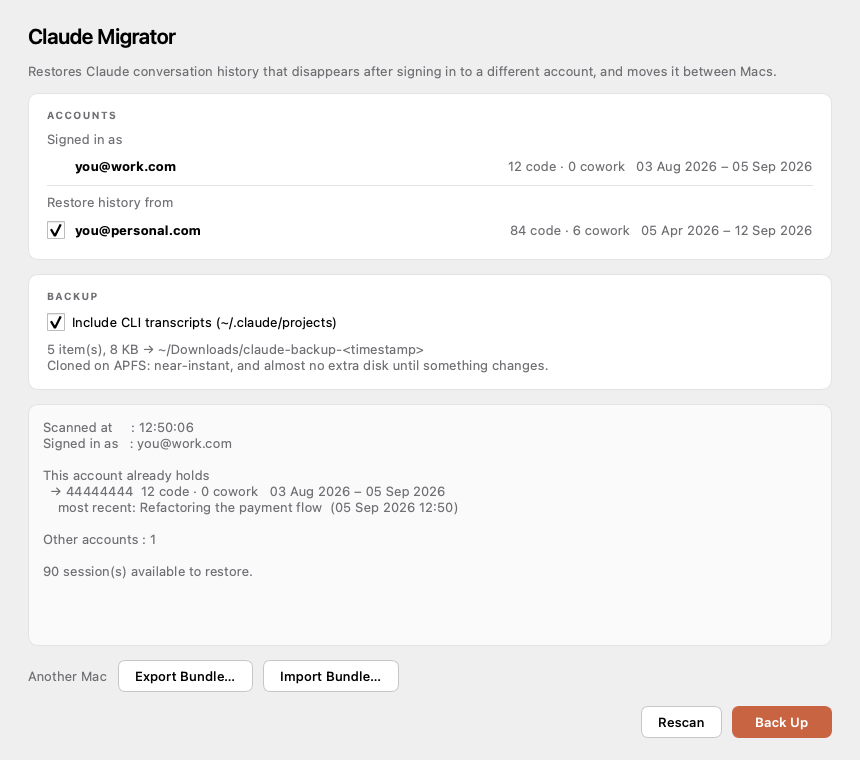

<div align="center">

# Claude Migrator

**Your Claude conversations did not disappear. They are just filed under your old account.**

A small macOS app that puts them back — and moves them between Macs.




</div>

---

## Run it

```bash
git clone https://github.com/pokharnajay/claude-migrator.git
cd claude-migrator
python3 app.py
```

That is the whole installation.

The first run takes about a minute: it creates a `.venv` inside the folder,
installs PySide6 into it, and starts the window. Every run after that opens
immediately. Nothing is installed into your system Python, and nothing is
written outside the folder you cloned into.

**Before you use it, quit the Claude desktop app.** The migrator refuses to
write anything while Claude is running — Claude holds these files open and
rewrites its own index as it goes.

<details>
<summary>Requirements</summary>

- macOS 11 or newer
- Python 3.10+ — `python3 --version` to check. macOS ships one; if it is too
  old, `brew install python` or grab it from [python.org](https://www.python.org/downloads/macos/).
- About 150 MB of disk for the `.venv`

</details>

<details>
<summary>If the first run fails</summary>

Delete the `.venv` folder and try again:

```bash
rm -rf .venv
python3 app.py
```

To set it up by hand instead:

```bash
python3 -m venv .venv
.venv/bin/pip install pyside6-essentials
.venv/bin/python app.py
```

</details>

## The problem it solves

Sign in to Claude with a different account and every previous conversation
vanishes from the sidebar. It looks like the history was wiped.

It was not. Claude's desktop app keys its session storage by account UUID:

```
~/Library/Application Support/Claude/
  config.json                                        → lastKnownAccountUuid
  claude-code-sessions/<account>/<org>/local_*.json
  local-agent-mode-sessions/<account>/<org>/local_*.json
```

A new sign-in makes the app read a different `<account>` folder. The old one is
still sitting on disk, untouched and unreachable.

Claude Migrator copies it into the account you are actually signed in to.

## Restore history on this Mac

| Step | What happens |
|------|--------------|
| **1. Scan** | Runs on launch, and again on **Rescan**. Reports what the signed-in account already holds — session counts, date range, and its most recent conversation — alongside every other account on this Mac, by e-mail. Writes nothing. |
| **2. Back Up** | Clones your entire Claude footprint to `~/Downloads/claude-backup-<timestamp>/`, then verifies it file-by-file. **Restore stays locked until verification passes.** |
| **3. Restore Sessions** | Merges the old account's sessions into the signed-in one. |

Or press **Merge** to do all three at once. It rescans, shows what it is about
to merge and asks you to confirm, takes a verified backup, then merges the ticked
accounts into the signed-in one. If the backup does not verify, nothing is merged.

Reopen Claude and the conversations are back in the sidebar.

Sessions whose CLI transcript is no longer on disk are listed at the end — they
return to the sidebar, but open empty.

## Move history to another Mac

**On the Mac that has the history**

1. Tick the account you want to move.
2. **Export Bundle…**

You get a zip in `~/Downloads` containing the sessions, the CLI transcripts
they need in order to actually open, and a SHA-256 for every file.

**On the other Mac**

1. Clone this repo, `python3 app.py`, sign in to Claude, then quit Claude.
2. **Import Bundle…** and pick the zip.

The sessions merge into whatever account is signed in there. Anything already
present is left alone.

> Sessions remember the folder they ran in. If that folder does not exist on
> the second Mac, the session still opens, but Claude will not find the project
> files. The import reports exactly which ones.

## What it will not do

This tool creates files. That is the entire surface area — there is no code
path in it that deletes or overwrites anything.

- **Never overwrites.** Files are created with `O_EXCL`, so the "does it exist"
  check and the write are one atomic step. A file Claude writes at the same
  moment is left exactly as Claude wrote it.
- **Never deletes.** No `rm`, no truncate, no move-aside.
- **Never half-writes.** Cowork session folders are built in a staging
  directory and moved into place. The archive index is a set union written to a
  temp file and renamed.
- **Never runs without a verified backup.** File counts and byte totals are
  compared per item before the restore button unlocks.
- **Refuses to escape.** A symlinked or oddly-named entry that resolves outside
  the folder being migrated is rejected.
- **Runs once at a time**, enforced by a PID lock that reclaims itself after a
  crash.

Re-running anything is a no-op. Machine-specific state
(`scheduled-tasks.json`, `rpm/`, `cowork-*-cache.json`, `debug/`) is
deliberately left behind — only conversation history moves.

### Imported bundles are treated as hostile

A zip from another machine is untrusted input. It is fully validated *before*
anything is extracted, and rejected outright for any of:

| Rejected | Why |
|---|---|
| Absolute paths, `..` traversal | Classic zip-slip — writing outside the target |
| Symlink members | Same, via a link that redirects a later write |
| Unexpected top-level directories | Only session stores and transcripts belong in a bundle |
| Non-UUID workspace segments | Malformed or hand-crafted paths |
| File names that are not sessions or transcripts | Blocks e.g. a shell script posing as a session |
| Missing, unreadable, or future-versioned manifest | Not produced by this tool |
| > 200,000 members, > 20 GB, or an implausible compression ratio | Zip bombs |

Every surviving member is then checksummed against the manifest and discarded
on mismatch.

## Privacy

Everything happens on your Mac. The app makes no network requests — there is no
networking code in it. Account e-mails are read from your own local config
purely to label the accounts in the window.

The one time anything is downloaded is the first run, when `pip` fetches
PySide6 from PyPI.

## How it is put together

| Module | Responsibility |
|---|---|
| [`app.py`](app.py) | Entry point — bootstraps the environment, opens the window |
| [`storage.py`](claude_migrator/storage.py) | Finds accounts, workspaces, and the signed-in account |
| [`identity.py`](claude_migrator/identity.py) | Resolves an account UUID to an e-mail and name |
| [`safety.py`](claude_migrator/safety.py) | Every write — containment, space, verification, locking |
| [`backup.py`](claude_migrator/backup.py) | APFS-cloned snapshot, then verifies it |
| [`sync.py`](claude_migrator/sync.py) | Plans and executes a same-machine merge |
| [`portable.py`](claude_migrator/portable.py) | Export to a zip; validate and import one |
| [`ui.py`](claude_migrator/ui.py) | The window |

Backups use APFS clones (`cp -c`), so snapshotting gigabytes of transcripts
takes about a second and costs almost no disk until something changes.

```bash
.venv/bin/pip install pytest
QT_QPA_PLATFORM=offscreen .venv/bin/python -m pytest -q    # 112 tests
```

Tests never touch real Claude data — they build a synthetic storage tree in a
temp directory, including the hostile archives the importer must refuse.

## Troubleshooting

**`python3: command not found`** — install Python from
[python.org](https://www.python.org/downloads/macos/) or with `brew install python`.

**The Restore button is greyed out** — Claude is still running. Quit it (⌘Q,
and check it is not in the Dock), then press **Rescan**.

**"Backup could not be verified"** — the copy did not match the source, so the
restore was refused before touching anything. Usually free disk space. The
partial backup folder is left in `~/Downloads` for inspection.

**My old account is not listed** — it has no storage on this Mac. If the
history is on another machine, use **Export Bundle** there instead.

**Restored sessions open empty** — the session came back but its CLI transcript
in `~/.claude/projects` is gone. The app lists these by title after a restore.
Nothing can recover the text if that file no longer exists.

## Licence

MIT — see [LICENSE](LICENSE).

Not affiliated with Anthropic.
